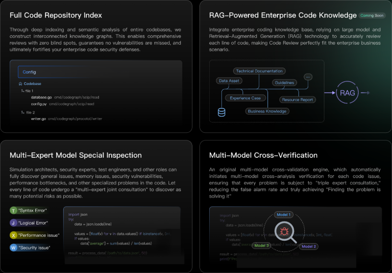
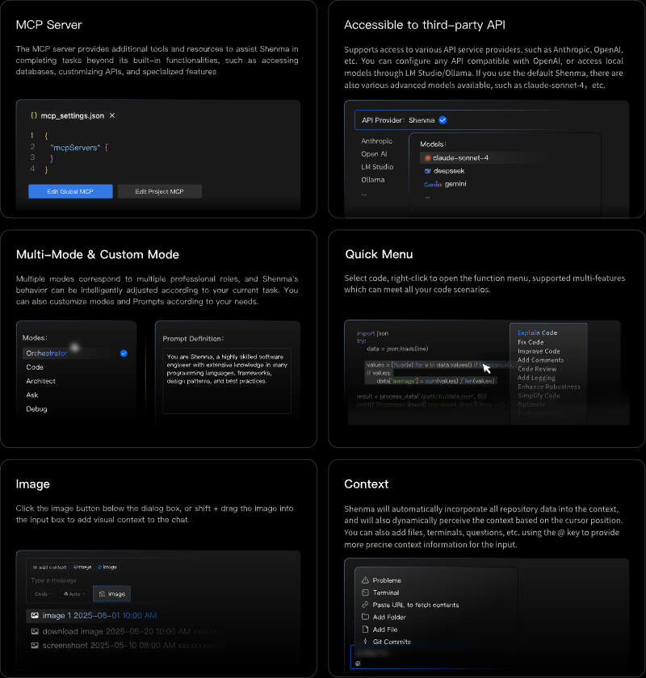

    <h1>Shenma</h1>
    <h2>The Best AI Coder for Enterprise-Grade Programming</h2>

 

English | <a href="https://github.com/zgsm-ai/costrict/blob/main/README.md" target="_blank">简体中文</a>

 
 

Shenma is a **free**, **open-source AI-assisted programming tool** that supports private deployment for enterprises, making it the optimal choice for enterprise serious programming. Its core capabilities are outstanding: Code Review, AI Agent, Code Completion, etc. Feature highlights include: enterprise-level code repository indexing, MCP service, multiple advanced free models, API/model customization, mode selection/customization, image context capabilities, and more. It supports multiple mainstream IDEs and leads the way in supporting VS Code. Compatible with popular languages including Python, Go, Java, JavaScript/TypeScript, and C/C++."

## Features

- **Code Review**: Code Review enables indexing and parsing of entire code repositories, implementing company-wide RAG (Retrieval-Augmented Generation) for coding knowledge. It adopts the strategy of "specialized checks by a multi-expert model" + "cross-confirmation by multiple models." It supports users in conducting code checks on functions, selected code lines, code files, and entire project files.

 

- **AI Agent**: The AI Agent can perform end-to-end tasks based on developer requirements, featuring capabilities including: autonomous decision-making, full-repository context retrieval, tool invocation, error repair, and terminal operation. While maintaining comparable effectiveness, it reduces costs by over 50% compared to other open-source alternatives.

 

- **Code Completion**: Code Completion automatically generates subsequent code based on the context around your cursor, delivering results in sub-second response times. It supports comment-based completion, variable completion, function completion, and more – all instantly accepted with a single Tab key press.

- **More features**: - **MCP Service**: Seamlessly integrates with the MCP open ecosystem to enable standardized system connectivity. You can Integrate external APIs、Connect to databases、Develop custom tools through MCP services. - **APIs & Model Customization**：Officially provided are multiple free advanced models like claude-sonnet-4; it also supports using third-party API providers such as Anthropic, OpenAI, etc.; you can also configure any API compatible with OpenAl; or use local models through I M Studio/Ollama - **Mode Customization**: We provide various default modes to adapt to different scenarios, such as the Code mode with outstanding coding capabilities and the Orchestrator mode skilled in complex task decomposition. You can also customize mode according to your needs. - **Context**: Shenma will automatically incorporate all repository data of large files into the context, and for code completion scenarios, it will also dynamically perceive the context based on the cursor position. You can also add files/folders, terminals, issues, etc. using the @ key to provide more precise context information for the input. - **Image**：You can click the image icon below the dialog box to upload an image, or you can hold down the Shift key to drag and drop the image into the input box. - **Quick Menu**: Select code, right-click to open the function menu, supported features include: Explain Code, Fix Code, Improve Code, Add Comments, Code Review, Add Logging, Enhance Robustness, Simplify Code, Optimize Performance, etc., which can meet all your code scenarios.

 

## Quick Start

### Deployment

Refer to [Deployment Guide](/assets/docs/guide/en-US/installation/README.md)

### Build

Refer to Development Documentation

## Contributing

We welcome contributions! Please review [How To Contribute](assets/docs/devel/en-US/how-to-contribute.md) for guidelines.

## Community

Communicate via [GitHub Issues](https://github.com/zgsm-ai/costrict/issues/new/choose) or pull requests.

## License

[Apache 2.0 © 2025 Sangfor, Inc.](./LICENSE)
