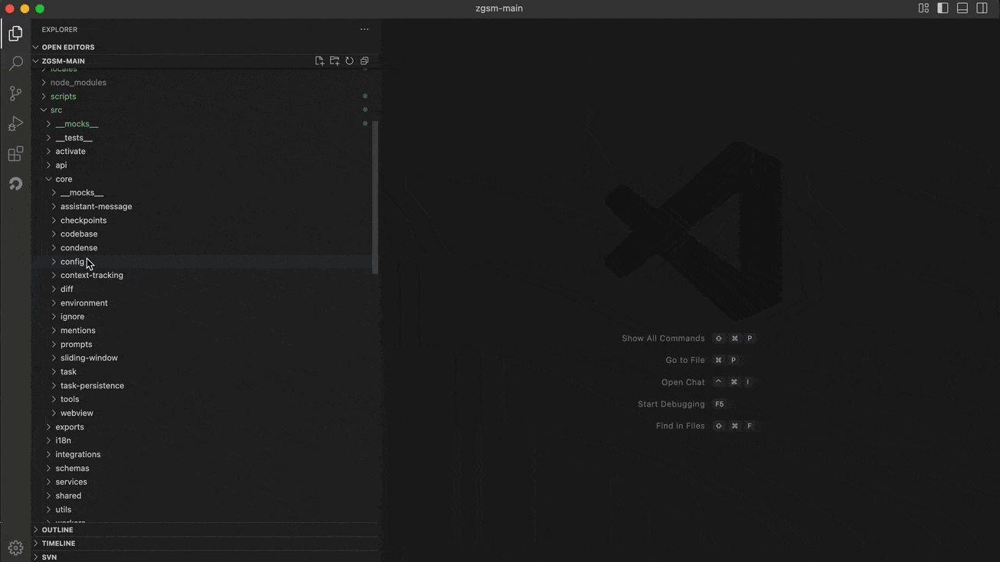
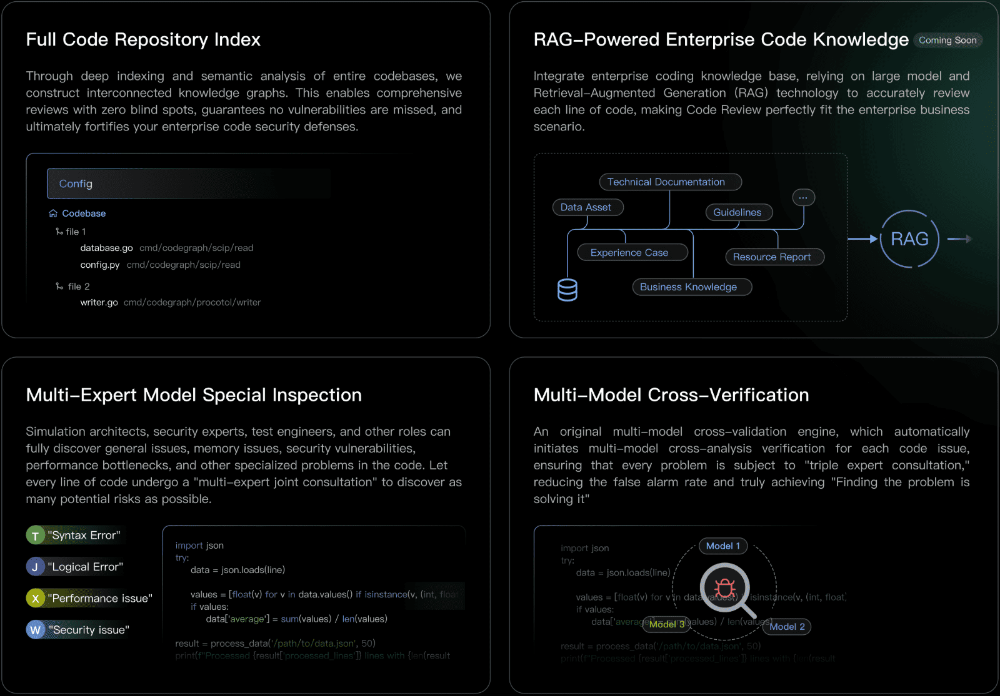
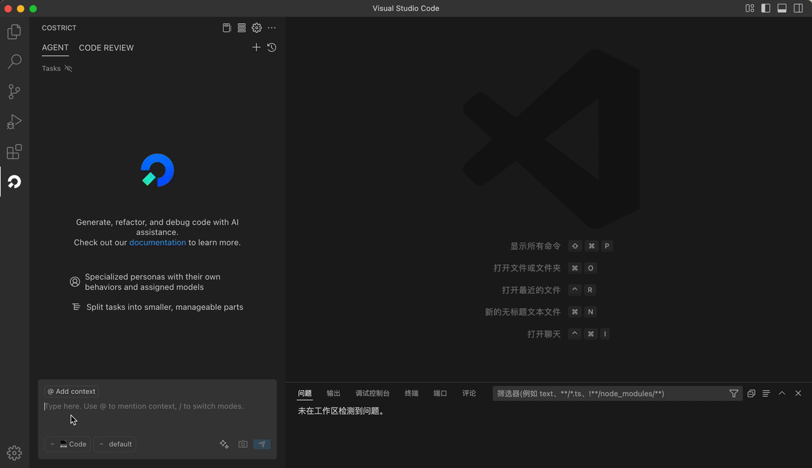
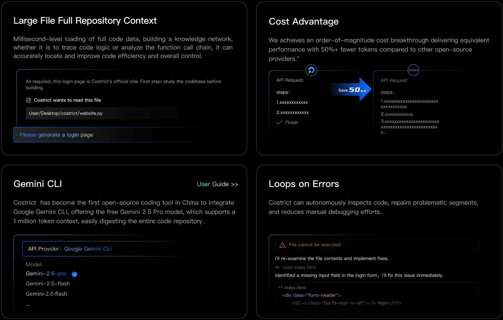
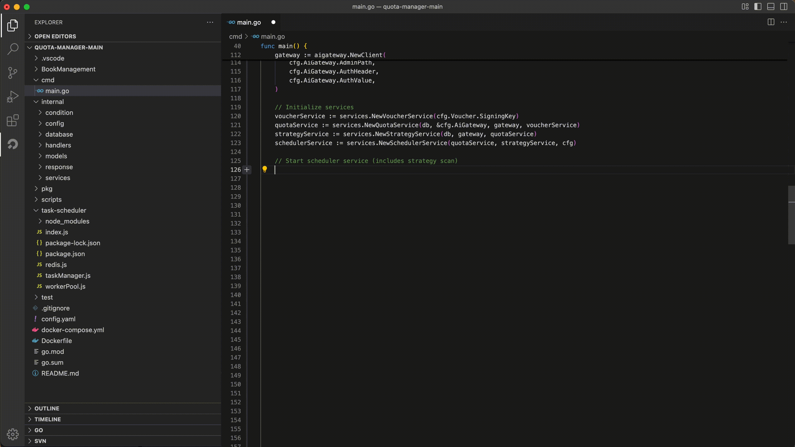
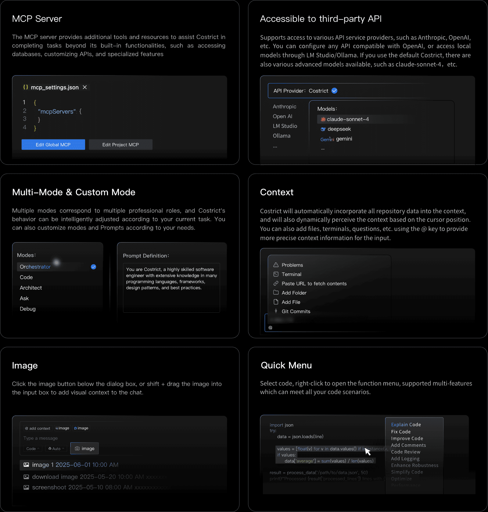

    <h1>Costrict（旧称：Shenma）</h1>
    <h2>本格的な開発のために構築されたエンタープライズグレードのAIエージェント</h2>

 

<a href="https://github.com/zgsm-ai/costrict/blob/main/README.md" target="_blank">English</a> | <a href="https://github.com/zgsm-ai/costrict/blob/main/README.zh-CN.md" target="_blank">简体中文</a> | 日本語

 
 

Costrictは**無料**で**オープンソース**のAI支援プログラミングツールで、企業向けのプライベートデプロイメントをサポートし、エンタープライズレベルの本格的なプログラミングに最適な選択肢です。その主要機能は優れています：コードレビュー、AIエージェント、コード補完など。機能のハイライトには、エンタープライズレベルのコードリポジトリインデックス、MCPサービス、複数の高度な無料モデル、API/モデルのカスタマイズ、モード選択/カスタマイズ、画像コンテキスト機能などが含まれます。複数の主流IDEをサポートし、VS Codeのサポートで先頭を走っています。Python、Go、Java、JavaScript/TypeScript、C/C++を含む人気のある言語と互換性があります。

## 機能

- **コードレビュー**：コードレビューは、コードリポジトリ全体のインデックス作成と解析を可能にし、コーディング知識のための企業全体のRAG（検索拡張生成）を実装します。「マルチエキスパートモデルによる専門的なチェック」+「複数モデルによるクロス確認」の戦略を採用しています。ユーザーが関数、選択したコード行、コードファイル、プロジェクトファイル全体でコードチェックを実行することをサポートします。

 

- **AIエージェント**：AIエージェントは、開発者の要件に基づいてエンドツーエンドのタスクを実行でき、自律的な意思決定、フルリポジトリコンテキスト検索、ツール呼び出し、エラー修復、ターミナル操作などの機能を備えています。同等の効果を維持しながら、他のオープンソースの代替品と比較して50%以上のコストを削減します。

 

- **コード補完**：コード補完は、カーソル周辺のコンテキストに基づいて後続のコードを自動的に生成し、サブセカンドの応答時間で結果を提供します。コメントベースの補完、変数補完、関数補完などをサポートし、すべてTabキーを1回押すだけで即座に受け入れられます。

- **その他の機能**：
    - **MCPサービス**：MCPオープンエコシステムとシームレスに統合し、標準化されたシステム接続を可能にします。MCPサービスを通じて、外部APIの統合、データベースへの接続、カスタムツールの開発が可能です。
    - **API＆モデルのカスタマイズ**：公式に提供されているのは、claude-sonnet-4などの複数の無料高度モデルです。また、Anthropic、OpenAIなどのサードパーティAPIプロバイダーの使用もサポートします。OpenAIと互換性のあるAPIを設定したり、I M Studio/Ollamaを通じてローカルモデルを使用したりすることもできます。
    - **モードのカスタマイズ**：コーディング能力に優れたCodeモードや、複雑なタスクの分解に長けたOrchestratorモードなど、さまざまなシナリオに適応するためのデフォルトモードを提供しています。ニーズに応じてモードをカスタマイズすることもできます。
    - **コンテキスト**：Costrictは、大規模ファイルのすべてのリポジトリデータをコンテキストに自動的に組み込み、コード補完シナリオでは、カーソル位置に基づいてコンテキストを動的に認識します。また、@キーを使用してファイル/フォルダー、ターミナル、イシューなどを追加し、入力により正確なコンテキスト情報を提供することもできます。
    - **画像**：ダイアログボックスの下にある画像アイコンをクリックして画像をアップロードしたり、Shiftキーを押しながら画像を入力ボックスにドラッグアンドドロップしたりできます。
    - **クイックメニュー**：コードを選択し、右クリックして機能メニューを開きます。サポートされている機能には、コードの説明、コードの修正、コードの改善、コメントの追加、コードレビュー、ロギングの追加、堅牢性の強化、コードの簡素化、パフォーマンスの最適化などが含まれ、すべてのコードシナリオに対応できます。

 

## クイックスタート

### デプロイメント

[デプロイメントガイド](/assets/docs/devel/en-US/deployment.md)を参照してください

### ビルド

開発ドキュメントを参照してください

## コントリビューション

貢献を歓迎します！ガイドラインについては[貢献方法](assets/docs/devel/en-US/how-to-contribute.md)をご確認ください。

## コミュニティ

[GitHub Issues](https://github.com/zgsm-ai/costrict/issues/new/choose)またはプルリクエストを通じてコミュニケーションしてください。

## ライセンス

[Apache 2.0 © 2025 Sangfor, Inc.](./LICENSE)

## スター履歴

