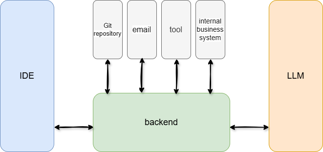
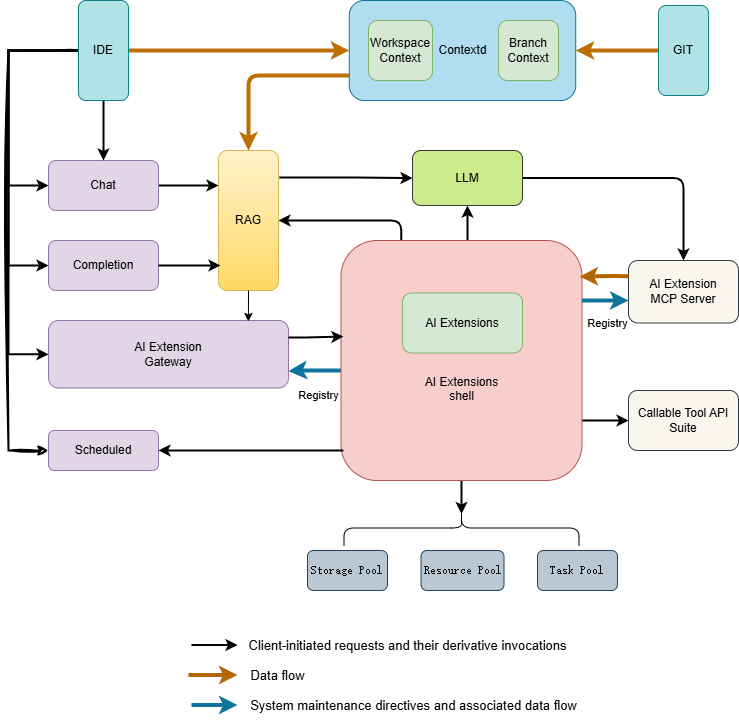

# Zhuge Shenma | AI Programming Assistant

English | [Simplified Chinese](./README.zh-CN.md)

Zhuge Shenma is an exquisitely crafted AI programming tool that revolutionizes developers' coding paradigms through sharp code completion capabilities and the infinite possibilities of open-source ecosystems. Seamlessly integrating human-machine collaboration in mainstream development environments like VSCode and JetBrains, it offers precise contextual awareness and multi-language support, making code creation as natural and fluid as flowing water.

## Features

- **Code Completion**: Automatically generates subsequent code based on cursor context, delivering instant results within seconds.

- **Intelligent Q&A**: Generate code and technical solutions directly in your workspace through natural language descriptions.

- **Quick Menu**: Integrates most practical features for one-click usability (coming soon).

- **Smart Team**: Multi-agent system (Mutil Agent) for end-to-end repository code generation (coming soon).

- **Multi-language Support**: Python, Go, Java, Vue, TypeScript, JavaScript, C/C++, Shell, Lua, PHP, Ruby, SQL, and other mainstream languages.

- **Privacy & Security**: Full-stack code open source with support for local deployment, ensuring no sensitive data leaks.

## Software Architecture

### System Overview Diagram

### Submodule Relationship Diagram

## Quick Start

### Deployment

Refer to [Deployment Guide](/docs/guide/en-US/installation/README.md)

### Build

Refer to Development Documentation

## Contributing

We welcome contributions! Please review [How To Contribute](docs/devel/en-US/how-to-contribute.md) for guidelines.

## Community

Communicate via [GitHub Issues](https://github.com/zgsm-ai/zgsm/issues/new/choose) or pull requests.

## License

Licensed under MIT. See [LICENSE](LICENSE) for full text.
