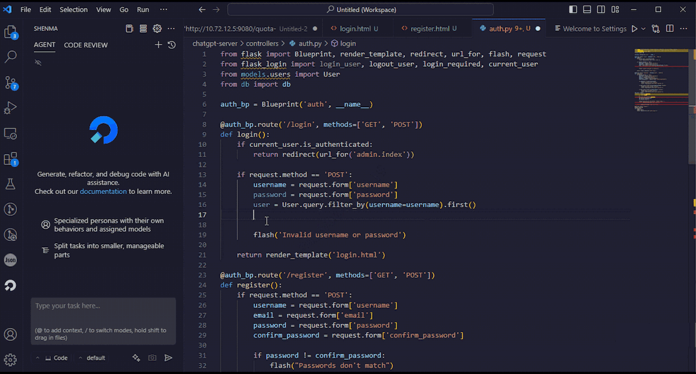

# Shenma | AI Programming Assistant

English | [简体中文](./README.zh-CN.md)

Shenma is a free and open-source AI programmer with powerful code generation capabilities that understand you better than programmers. It makes your daily work from "writing code" to easier "asking questions" and "reviewing code". Compared to other tools, we are more secure and reliable, supporting enterprise private deployment, and most importantly, we are completely free.

## Features

- **Code Completion**: Automatically generates subsequent code based on cursor context, delivering instant results within seconds

- **Intelligent Q&A**: Generate code and technical solutions directly in your workspace through natural language descriptions

- **Quick Menu**: Select the code and right-click to bring up the function menu, which is powerful and can meet all your code scenarios

- **More features**: Support MCP Server, Custom Modes, multiple model switching, context referencing, image and etc…Looking forward to your exploration

- **Multi-language Support**: Python, Go, Java, Vue, TypeScript, JavaScript, C/C++, Shell, Lua, PHP, Ruby, SQL, and other mainstream languages.

- **Privacy & Security**: Full-stack code open source with support for local deployment, ensuring no sensitive data leaks.

## Software Architecture

### System Overview Diagram

### Submodule Relationship Diagram

## Quick Start

### Deployment

Refer to [Deployment Guide](/assets/docs/guide/en-US/installation/README.md)

### Build

Refer to Development Documentation

## Contributing

We welcome contributions! Please review [How To Contribute](assets/docs/devel/en-US/how-to-contribute.md) for guidelines.

## Community

Communicate via [GitHub Issues](https://github.com/zgsm-ai/zgsm/issues/new/choose) or pull requests.

## License

Licensed under MIT. See [LICENSE](LICENSE) for full text.
