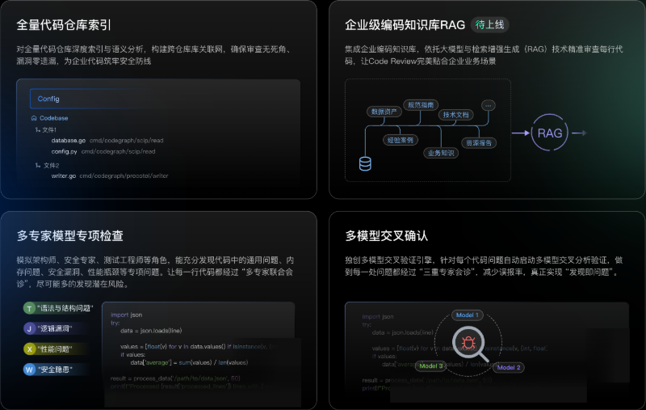
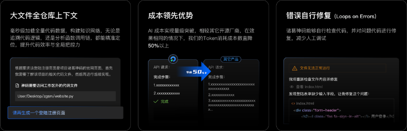
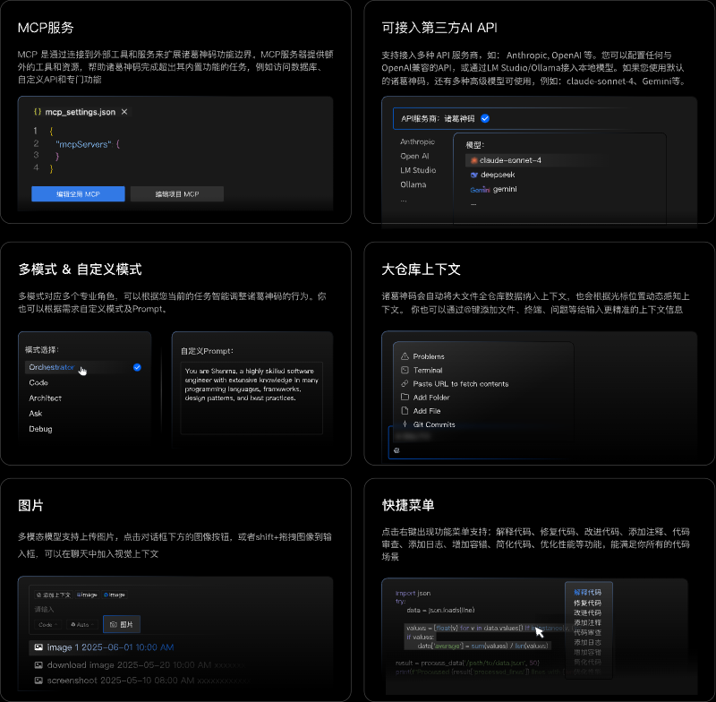

    <h1>Costrict</h1>
    <h2>企业严肃编程的最佳AI Coder</h2>

 

<a href="https://github.com/zgsm-ai/costrict/blob/main/README.en-US.md" target="_blank">English</a> | 简体中文

 
 

Costrict是一款免费开源的AI辅助编程工具，支持企业私有化部署，是企业严肃编程的最佳选择。核心场景能力突出：代码审查（Code Review）、智能体（ AI Agent）、代码补全（Code Completion）等，特性功能亮点十足：企业级代码仓库索引、MCP服务、多种高级免费模型、API/模型自定义、模式选择/自定义、图片上下文等。支持多种主流IDE工具，率先支持VS Code。支持Python、Go、 Java、JavaScript/TypeScript、C/C++等多种主流语言。

## 产品特性 Features

- **代码审查（Code Review）**：代码审查能够进行全量代码仓库的索引解析，公司级编码知识库RAG（增强检索） 在发现问题和确认问题上采用“多专家模型专项检查”+“多模型交叉确认”策略 支持用户对函数、选中代码行、代码文件和整个工程文件进行代码检查

 

- **智能体（AI Agent）:**： 智能体能够根据开发者的需求端到端完成任务，具备：自主决策、全仓库上下文检索、调用工具、错误修复、运行终端等能力。在效果一致的情况下，Token消耗成本相较其它开源软件，能节省 50%以上

 

- **代码补全（Code Completion）**：代码自动补全，根据光标的上下文代码，自动生成后续代码，快速秒级出码 支持注释描述的补全，变量补全，函数补全等，Tab 一键采纳

 

 

- **更多特性（More Features）**：
    - **MCP 服务**：无缝对接MCP开放生态，实现标准化系统连接。您可以通过MCP服务集成外部 API、连接数据库或开发定制工具等
    - **第三方API和模型自定义**: 官方提供了各种免费的高级模型，像claude-sonnet-4；也支持使用第三方API提供商如Anthropic、OpenAl等；您还可以配置任何与OpenAl兼容的API；或者通过I M Studio/Ollama使用本地模型
    - **模式自定义**：我们提供了多种默认模式以适应不同场景，例如：代码能力突出的Code模式、擅长复杂任务拆解的Orchestrator模式。您也可以根据需求自定义模式
    - **大仓库上下文**：Costrict会自动将大文件全仓库数据纳入上下文，对于代码补全场景也会根据光标位置动态感知上下文。 你也可以通过@键添加文件/文件夹、终端、问题等等给输入更精准的上下文信息
    - **支持图片**：多模态模型支持上传图片，您可以点击对话框下方的图片icon上传图片，也可以按住shift键将图片拖拽到输入框内
    - **快捷菜单**： 选中代码，点击右键出现功能菜单，支持：解释代码、修复代码、改进代码、添加注释、代码审查 、添加日志、增加容错、简化代码、优化性能等功能，能满足你所有的代码场景

## 更多帮助 For more assistance

更多操作详情可访问Costrict官方文档： https://costrict.ai/download

## 快速开始

### 部署

请参考 [部署指南](/assets/docs/guide/zh-CN/installation/README.md)

### 构建

请参考 开发文档

## 如何贡献

Costrict是由友好的用户、贡献者、提交者和项目管理委员会成员共同开发和维护的开源项目。

欢迎所有人以多种方式加入并为项目做出贡献，不仅限于代码贡献。诸如上报问题、报告漏洞、提议新功能、改进文档、完善网站、组织活动或撰写博客文章等贡献均受到欢迎和认可。

本文档是Costrict社区新成员入门贡献项目的指南。

### 上报问题

首先确保该问题尚未报告，您可以在 GitHub 的 [Issues](https://github.com/zgsm-ai/costrict/issues) 下进行搜索。

如果您无法找到一个开放的问题来解决该问题，可以 [新建 Issue](https://github.com/zgsm-ai/costrict/issues/new/choose)。请确保包含一个标题和清晰的描述，尽可能多的相关信息，以及一个代码示例或可执行的测试用例，以方便其他维护者复现该问题。

### 提交代码

Costrict项目采用 Github Forking 工作流：[Costrict项目代码贡献流程](https://github.com/zgsm-ai/costrict/blob/main/assets/docs/devel/zh-CN/fork.md)

## 版权声明

[Apache 2.0 © 2025 Sangfor, Inc.](./LICENSE)
