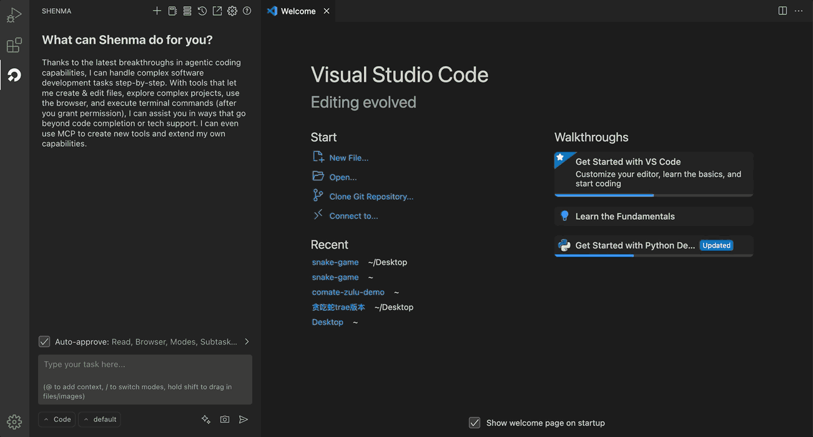
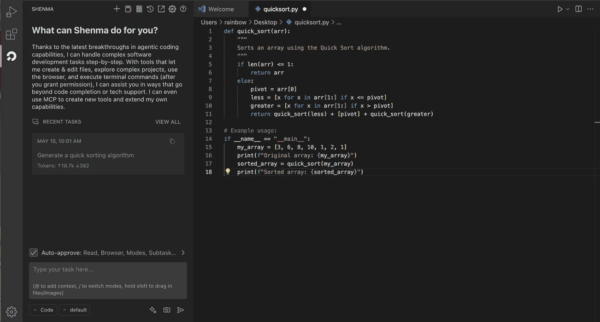
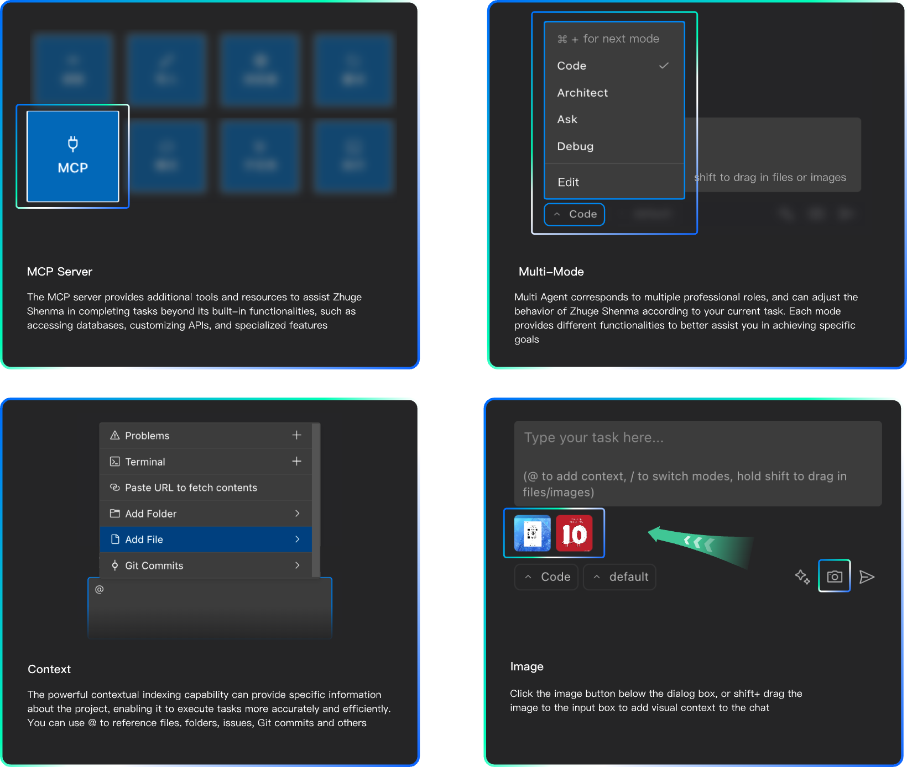
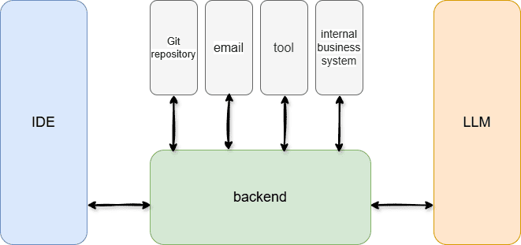
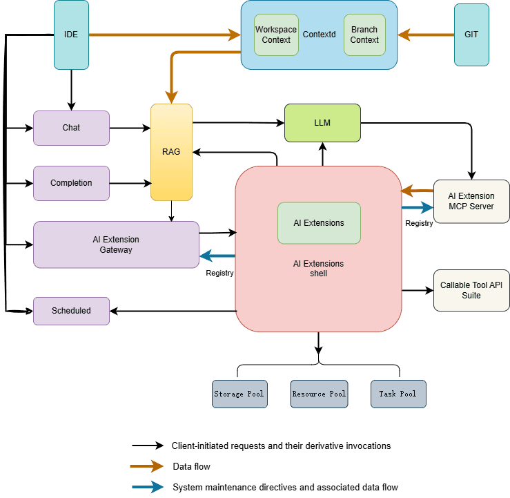

# 诸葛神码 | AI 编程助手

[English](./README.md) | 简体中文

神码是一个免费开源的AI程序员，拥有强大的代码生成能力，比程序员更懂你，它的出现将您的日常工作重点从代码的“编”切换成更为轻松的“问”和“审”。相比其它插件，我们更加安全可靠，支持企业级的私有化部署，关键还完全免费。

## 功能特性

- **代码补全**：根据光标的上下文代码，自动生成后续代码，快速秒级出码。

- **智能问答**：通过自然语言描述，直接在编程工作区，即可生成代码和技术问答，省心省力

- **快捷菜单**：选中代码，点击右键出现功能菜单，功能强大，能满足你所有的代码场景

- **更多特性**：支持MCP Server、自定义模式、丰富的模型切换、上下文引用和图片引用等等，期待您的探索

- **多语言支持**：支持 python、go、java、vue、typescript、javascript、c/c++、shell、lua、php、ruby、SQL等主流语言

- **隐私安全**：全栈代码开源，支持服务本地化部署，杜绝敏感信息泄露

## 软件架构

### 整体架构图

### 子模块关系图

## 快速开始

### 部署

请参考 [部署指南](/assets/docs/guide/zh-CN/installation/README.md)

### 构建

请参考 开发文档

## 如何贡献

欢迎贡献代码，贡献流程可以参考 [How To Contribute](assets/docs/devel/zh-CN/how-to-contribute.md)。

## 社区

You are encouraged to communicate most things via [GitHub issues](https://github.com/zgsm-ai/zgsm/issues/new/choose) or pull requests.

## License

IAM is licensed under the MIT. See [LICENSE](LICENSE) for the full license text.
