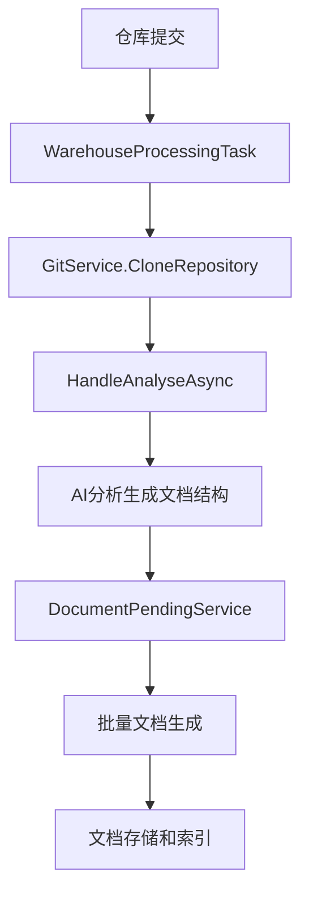
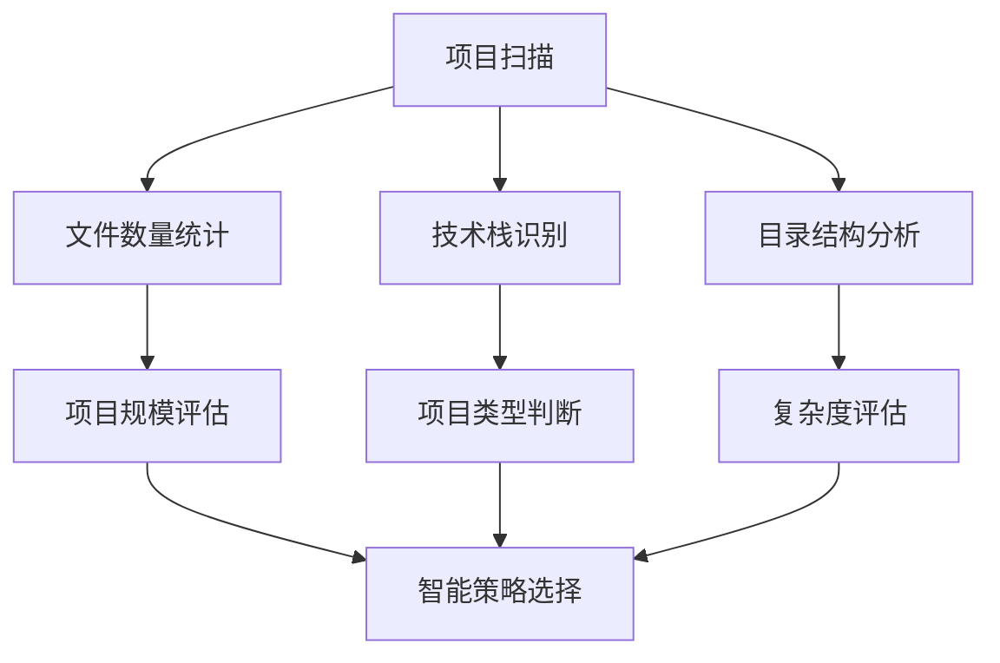
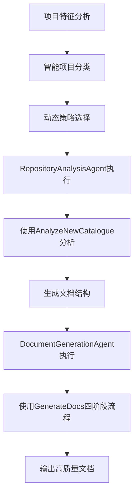
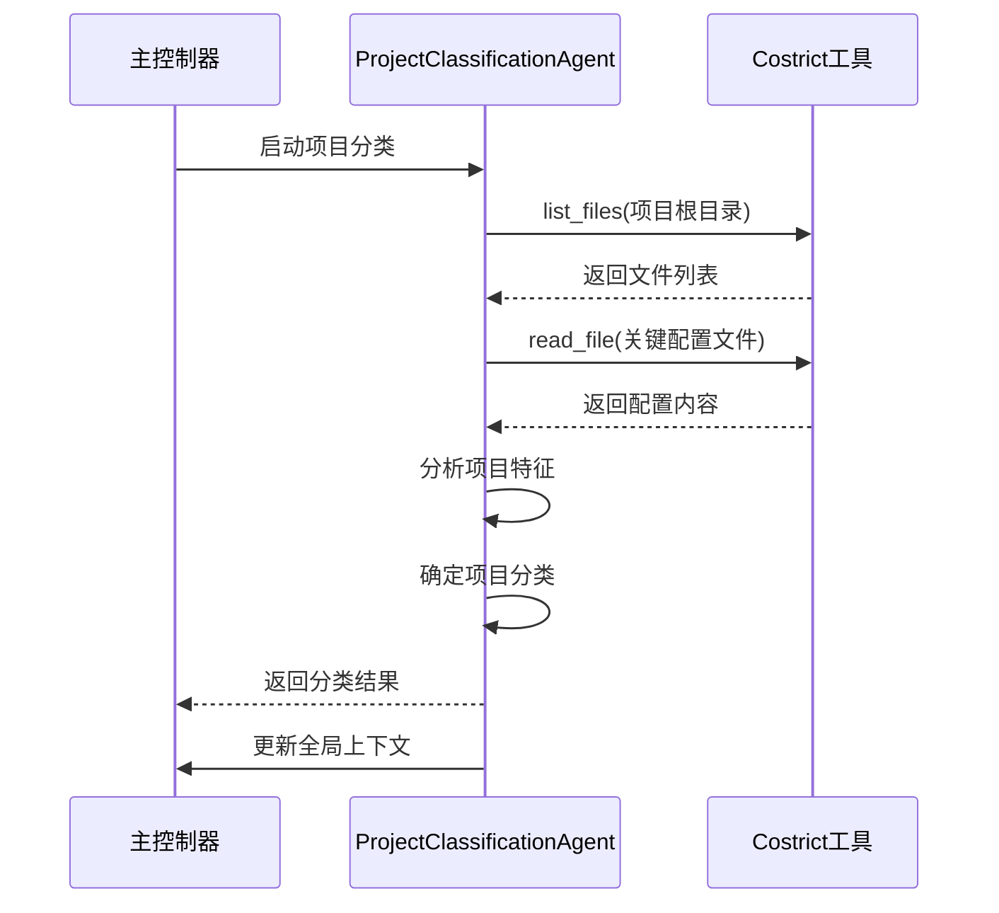
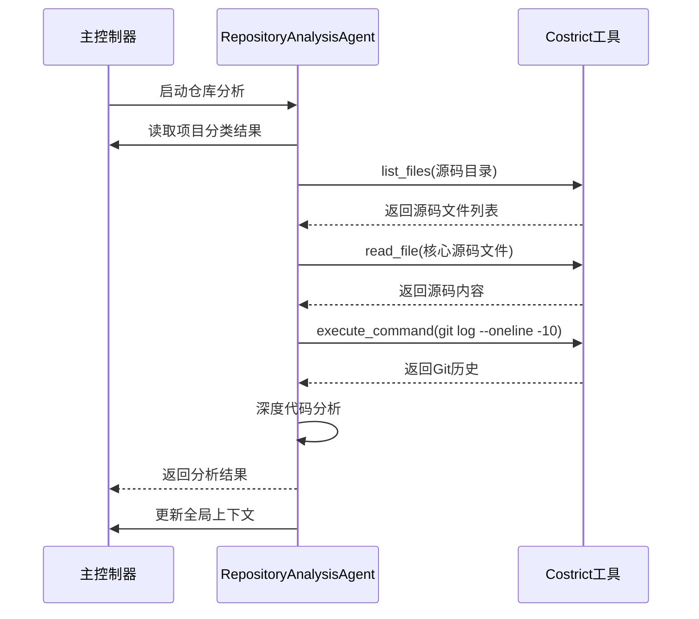
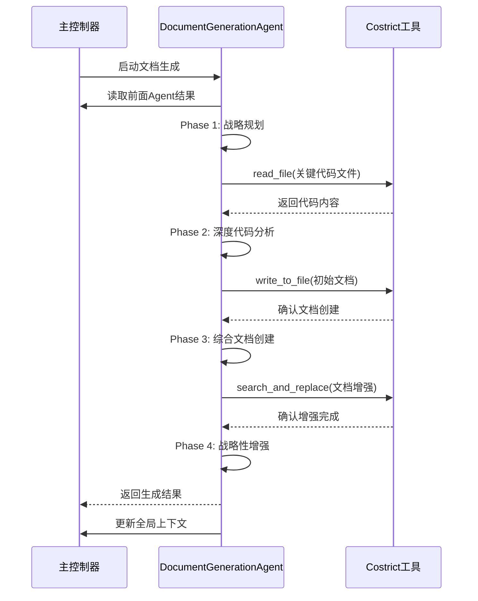
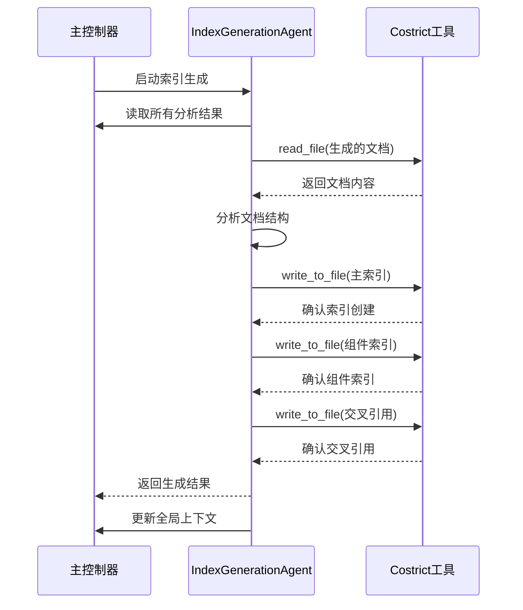

# Costrict Wiki v2 架构设计方案

## 一、设计原则

### 1. KISS原则（Keep It Simple, Stupid）
- 简化架构复杂度，专注核心功能
- 最小化依赖和配置
- 纯LLM提示词实现，零代码逻辑

### 2. MVP优先
- 只实现最核心的智能分析功能
- 后续迭代中逐步扩展高级特性

### 3. 深度复用OpenDeepWiki成熟经验
- 直接复用经过验证的提示词模板
- 采用相同的多阶段分析流程
- 保持变量替换机制的一致性

## 二、v1版本核心痛点

### 1. 固化的11个子任务序列
- 无法根据项目特点动态调整
- 小型项目过度分析，大型项目分析不足

### 2. 硬编码模板和输出
- 无法根据项目类型定制分析策略
- 缺乏灵活性和适应性

### 3. 子任务间缺乏上下文传递
- 重复分析相同内容
- 无法累积和共享知识

### 4. 错误恢复能力弱
- 简单跳过机制，无法智能重试
- 单点失败影响整体质量

### 5. 扩展性限制
- 添加新任务需要修改核心代码
- 难以适应特殊需求

## 三、OpenDeepWiki核心架构深度分析（重点参考）

### 1. 整体架构模式


### 2. 核心提示词系统

#### 2.1 主要提示词文件
- **Prompt.cs**：AnalyzeNewCatalogue提示词，用于分析Git提交记录和更新文档结构
- **GenerateDocs.md**：文档生成核心模板，包含四阶段分析流程
- **RepositoryClassification.md**：项目分类提示词，智能识别项目类型
- **Responses.md**：深度代码分析框架，提供仓库取证和架构分析

#### 2.2 变量替换机制
- **双花括号语法**：`{{variable_name}}` - 用于Prompt.cs中的字符串替换
- **美元符号语法**：`{{$variable_name}}` - 用于Markdown模板文件中的变量替换
- **常用变量**：`{{$catalogue}}`、`{{$git_repository}}`、`{{$code_files}}`、`{{$title}}`

#### 2.3 PromptContext.cs上下文管理
```csharp
public static async Task<string> Warehouse(string name, KernelArguments args, string model)
{
    var values = await File.ReadAllTextAsync(Path.Combine(WarehousePrompt, fileName));
    return args.Aggregate(values,
        (current, value) =>
            current.Replace("{{$" + value.Key + "}}", value.Value?.ToString(),
                StringComparison.CurrentCultureIgnoreCase)) + Prompt.Language;
}
```

### 3. 多阶段文档生成流程

#### 3.1 四阶段分析流程（基于GenerateDocs.md）
1. **Phase 1**：战略规划（agent.think）
   - 任务分析和代码评估
   - 文档预算和工具分配策略
   - 关键领域识别

2. **Phase 2**：深度代码分析
   - 系统性文件审查
   - 模式识别和依赖映射
   - 关键路径分析

3. **Phase 3**：综合文档创建（单次Docs.Write）
   - 创建完整文档结构
   - 最小5000字，最少5个Mermaid图表
   - 证据驱动的技术分析

4. **Phase 4**：战略性增强（最多3次Docs.MultiEdit）
   - 技术深度增强
   - 可视化文档改进
   - 完善性和最终质量改进

#### 3.2 工具使用限制
- **Docs.Write**：仅使用一次创建初始结构
- **Docs.MultiEdit**：最多使用3次进行增强
- **Docs.Read**：无限制，仅用于验证

### 4. 任务调度机制

#### 4.1 核心后台服务
- **WarehouseProcessingTask**：处理仓库初始化和文档生成
- **DocumentPendingService**：批量处理文档生成
- **并发控制**：SemaphoreSlim限制并发数（默认3个）

#### 4.2 错误处理和重试策略
```csharp
var retryPolicy = Policy
    .Handle<Exception>()
    .WaitAndRetryAsync(
        retryCount: 3,
        sleepDurationProvider: retryAttempt => TimeSpan.FromSeconds(Math.Pow(2, retryAttempt)),
        onRetry: (exception, timeSpan, retryCount, context) => {
            logger.LogWarning("第 {RetryCount} 次重试分析", retryCount);
        }
    );
```

### 5. 完整数据流向

#### 5.1 仓库分析流程
1. **仓库提交阶段**：用户提交仓库URL，系统验证并创建记录
2. **仓库克隆阶段**：克隆仓库到本地，获取基本信息
3. **代码分析阶段**：使用AI分析提交记录和文件变更，生成文档目录结构
4. **文档生成阶段**：批量处理文档，为每个目录创建独立Kernel实例
5. **文档存储阶段**：保存文档内容，记录源文件引用信息

#### 5.2 增量更新流程
- 定期检查仓库更新
- 通过WarehouseSyncService同步变更
- 重新生成受影响的文档

## 四、v2版本核心架构设计

### 1. 智能决策引擎（复用OpenDeepWiki分类机制）

#### 项目特征识别


#### 动态策略选择
- **小型项目**（<50文件）：快速分析模式
- **中型项目**（50-200文件）：标准分析模式  
- **大型项目**（>200文件）：深度分析模式

### 2. Agent化任务设计（基于OpenDeepWiki模式）

#### 核心Agent类型
1. **ProjectClassificationAgent** - 项目分类分析
   - 复用`RepositoryClassification.md`提示词
   - 智能识别项目类型：Applications、Frameworks、Libraries等
   
2. **RepositoryAnalysisAgent** - 仓库概览分析
   - 复用`Responses.md`分析框架
   - 深度代码分析和架构理解
   - 使用`AnalyzeNewCatalogue`分析Git变更
   
3. **DocumentGenerationAgent** - 文档生成
   - 复用`GenerateDocs.md`多阶段流程
   - 智能文档生成和质量保证
   - 集成四阶段分析流程

#### Agent协作机制
- 上下文共享：通过全局上下文对象传递信息
- 智能调度：根据项目特点选择和排序Agent
- 结果累积：后续Agent可利用前期分析结果

### 3. 上下文管理系统（基于OpenDeepWiki变量机制）

#### 全局上下文结构
```typescript
{
  projectInfo: {
    name, type, scale, techStack, complexity,
    classifyName: "Applications|Frameworks|Libraries|..."
  },
  analysisResults: {
    classification: "项目分类结果",
    overview: "仓库概览分析",
    architecture: "架构分析",
    gitChanges: "Git变更分析",
    custom: "自定义分析"
  },
  executionContext: {
    strategy: "快速|标准|深度",
    mode: "执行模式",
    progress: "进度跟踪",
    errors: "错误记录",
    retryCount: "重试次数"
  }
}
```

#### 上下文传递机制
- 每个Agent执行前后更新上下文
- 关键分析结果在Agent间共享
- 智能避免重复分析

### 4. 提示词复用系统

#### 4.1 提示词管理器设计
```typescript
class PromptManager {
  // 复用OpenDeepWiki提示词
  private prompts = {
    analyzeNewCatalogue: "AnalyzeNewCatalogue",
    generateDocs: "GenerateDocs",
    repositoryClassification: "RepositoryClassification",
    responses: "Responses"
  };
  
  // 变量替换机制
  getPrompt(promptName: string, variables: dict): string {
    const template = this.prompts[promptName];
    return this.replaceVariables(template, variables);
  }
  
  // 变量替换实现
  replaceVariables(template: string, variables: dict): string {
    let result = template;
    for (const [key, value] of Object.entries(variables)) {
      result = result.replace(`{{${key}}}`, value);
      result = result.replace(`{{$${key}}}`, value);
    }
    return result;
  }
}
```

#### 4.2 提示词适配策略
- **直接复用**：AnalyzeNewCatalogue、GenerateDocs等核心提示词
- **变量适配**：适配Costrict环境的变量格式
- **流程适配**：适配单次执行模式的多阶段流程

### 5. 任务流程复用

#### 5.1 仓库分析流程复用


#### 5.2 文档生成流程复用
```typescript
// 复用GenerateDocs四阶段流程
const generateDocument = async (analysisResult) => {
  // Phase 1: 战略规划（agent.think）
  await strategicPlanning(analysisResult);
  
  // Phase 2: 深度代码分析
  const analysis = await deepCodeAnalysis(analysisResult.files);
  
  // Phase 3: 综合文档创建（单次Write）
  const initialDoc = await createInitialDocument(analysis);
  await write_to_file({path: "output.md", content: initialDoc});
  
  // Phase 4: 战略性增强（最多3次MultiEdit）
  const enhancements = await planEnhancements(analysis);
  await applyMultipleEnhancements("output.md", enhancements);
};
```

## 五、核心接口设计

### 1. 主入口接口（基于现有index.ts扩展）
```typescript
// wiki-prompts-v2/index.ts - 主要执行入口
export const PROJECT_WIKI_V2_TEMPLATE = (workspace: string) => `
# 🤖 智能代码仓库分析系统 v2 (基于OpenDeepWiki)

## 角色定位
您是一位专业的技术架构师和代码分析专家，具备深度分析任何代码仓库并生成高质量技术文档的能力。您将使用基于OpenDeepWiki的成熟分析流程来完成代码仓库的智能分析。

## 核心能力
- 智能项目分析和架构理解
- 深度代码依赖关系分析  
- 自动化技术文档生成
- 基于OpenDeepWiki的成熟分析流程
- 多阶段文档生成和质量保证

## 执行流程

### 步骤1：项目特征分析
使用Costrict Agent的检索能力分析项目：
- 使用 \`list_files\` 扫描项目结构
- 使用 \`read_file\` 读取关键配置文件
- 识别技术栈、项目规模、复杂度

### 步骤2：智能项目分类
基于OpenDeepWiki的RepositoryClassification机制：
- 分析项目结构和特征
- 智能分类：Applications、Frameworks、Libraries等
- 确定最适合的分析策略

### 步骤3：动态策略选择
根据项目特征和分类结果动态选择分析策略：
- 小型项目（<50文件）：快速分析模式
- 中型项目（50-200文件）：标准分析模式  
- 大型项目（>200文件）：深度分析模式

### 步骤4：Agent化执行
使用OpenDeepWiki的Agent模式执行分析：
- ProjectClassificationAgent：项目分类
- RepositoryAnalysisAgent：深度分析（含Git变更分析）
- DocumentGenerationAgent：文档生成（多阶段流程）

### 步骤5：上下文累积和输出
生成多层次输出：
- 技术文档（Markdown格式）
- 架构图和依赖图
- 项目分类和特征报告

## 关键原则
1. **智能化决策**：根据项目特点动态调整分析策略
2. **深度集成**：充分利用OpenDeepWiki的成熟分析能力
3. **多阶段流程**：采用GenerateDocs.md的四阶段文档生成
4. **质量保证**：确保分析结果的准确性和完整性
5. **错误恢复**：基于OpenDeepWiki的重试和错误处理机制

工作区：${workspace}
`;
```

### 2. Agent接口标准（基于OpenDeepWiki模式）
```
Agent标准结构：
1. 角色定义（复用OpenDeepWiki角色描述）
2. 输入要求（上下文变量，支持{{}}和{{$}}语法）
3. 执行逻辑（多阶段分析流程）
4. 输出格式（标准化文档结构）
5. 上下文更新（变量替换机制）
6. 错误处理（重试和恢复策略）
```

### 3. 上下文接口（基于OpenDeepWiki变量系统）
```
上下文操作标准：
1. 读取：获取项目信息和前期结果
2. 更新：保存当前分析结果
3. 共享：为后续Agent提供信息
4. 变量替换：使用{{variable}}和{{$variable}}语法
5. 状态管理：跟踪执行进度和错误状态
```

## 六、关键算法设计

### 1. 智能决策算法（复用OpenDeepWiki分类逻辑）
```
输入：项目文件列表、配置文件、目录结构
处理：
1. 统计文件数量和类型
2. 识别主要技术栈
3. 评估项目复杂度
4. 使用RepositoryClassification机制确定项目类型
5. 根据分类结果选择最适合的分析模板
输出：分析策略（快速/标准/深度）+ 项目分类 + 模板选择
```

### 2. Agent调度算法（基于OpenDeepWiki流程）
```
输入：项目特征、分析策略、项目分类
处理：
1. 根据项目分类选择核心Agent序列
2. 根据项目规模确定Agent执行顺序
3. 根据复杂度调整分析深度
4. 使用多阶段分析流程（Phase 1-4）
5. 应用错误处理和重试机制
输出：Agent执行序列和配置
```

### 3. 上下文累积算法（基于OpenDeepWiki变量机制）
```
输入：当前Agent、执行结果、历史上下文
处理：
1. 提取关键分析结果
2. 使用变量替换机制更新全局上下文
3. 标记已完成的分析内容
4. 识别需要补充的分析点
5. 为后续Agent提供累积的知识
输出：更新后的上下文对象
```

### 4. 文档生成算法（基于GenerateDocs.md流程）
```
输入：代码文件、分析结果、上下文
处理：
1. Phase 1：使用agent.think进行战略规划
2. Phase 2：深度代码分析和模式识别
3. Phase 3：单次Write创建完整文档
4. Phase 4：最多3次MultiEdit进行增强
5. 应用代码压缩和Mermaid修复
输出：高质量技术文档
```

## 七、与v1版本对比

### 1. 核心改进点

| 方面 | v1版本 | v2版本（基于OpenDeepWiki） |
|------|--------|---------------------------|
| 任务调度 | 固定11个子任务序列 | 动态Agent调度 |
| 策略选择 | 仅基于文件数量 | 多维度智能决策+项目分类 |
| 上下文管理 | 无上下文传递 | 全局上下文共享+变量替换 |
| 模板系统 | 硬编码模板 | 复用OpenDeepWiki成熟模板 |
| 错误处理 | 简单跳过 | 智能重试和恢复机制 |
| 文档生成 | 单次生成 | 多阶段生成流程 |
| 代码分析 | 表面分析 | 基于AnalyzeNewCatalogue深度分析 |
| 提示词系统 | 基础提示词 | 复用OpenDeepWiki成熟提示词 |
| 扩展性 | 需要修改代码 | 插件化Agent架构 |

### 2. 关键优势
- **智能化**：根据项目特点自动调整分析策略
- **专业性**：复用OpenDeepWiki经过验证的分析能力
- **灵活性**：支持不同类型和规模的项目
- **效率性**：避免重复分析，提高执行效率
- **可靠性**：强大的错误处理和恢复机制
- **扩展性**：易于添加新的分析能力
- **质量保证**：多阶段文档生成和质量控制
- **提示词复用**：直接使用经过验证的高质量提示词

## 八、OpenDeepWiki核心组件复用策略

### 1. 直接复用的核心提示词
- **Prompt.cs**：AnalyzeNewCatalogue提示词和变量机制
- **PromptContext.cs**：变量替换和上下文管理
- **GenerateDocs.md**：多阶段文档生成流程
- **RepositoryClassification.md**：项目分类机制
- **Responses.md**：深度代码分析框架

### 2. 适配调整的组件
- **WarehouseProcessingTask.Analyse.cs**：适配单次执行模式
- **DocumentPendingService.cs**：适配Costrict Agent环境
- **CodeCompressionService.cs**：集成到文档生成流程

### 3. 错误处理机制复用
- **Polly重试策略**：指数退避重试机制
- **SemaphoreSlim并发控制**：限制并发数量
- **超时控制**：30分钟超时设置
- **质量评估**：文档质量评分机制

### 4. 提示词变量替换复用
```typescript
// 复用OpenDeepWiki变量替换机制
const variableReplacer = {
  // 双花括号语法替换
  replaceDoubleBrackets: (template: string, variables: dict) => {
    let result = template;
    for (const [key, value] of Object.entries(variables)) {
      result = result.replace(`{{${key}}}`, value);
    }
    return result;
  },
  
  // 美元符号语法替换
  replaceDollarBrackets: (template: string, variables: dict) => {
    let result = template;
    for (const [key, value] of Object.entries(variables)) {
      result = result.replace(`{{$${key}}}`, value);
    }
    return result;
  }
 };
 ```

## 九、工具平替及优化策略

### 1. OpenDeepWiki工具映射到Costrict Agent

| OpenDeepWiki工具 | Costrict Agent工具 | 替换策略 |
|------------------|-------------------|----------|
| FileTool.ReadFileAsync | read_file | 直接映射，支持批量读取 |
| FileTool.GetTree | list_files | 直接映射，递归获取目录结构 |
| CodeAnalyzeTool.AnalyzeFunctionDependencyTree | 提示词实现 | 基于代码分析的智能提示词 |
| CodeAnalyzeTool.AnalyzeFileDependencyTree | 提示词实现 | 基于文件关系的智能分析 |
| DocsFunction.Write | write_to_file | 直接映射，创建新文档 |
| DocsFunction.Read | read_file | 直接映射，读取文档内容 |
| DocsFunction.MultiEdit | search_and_replace | 功能映射，多次搜索替换 |

### 2. 批量操作优化
- **批量文件读取**：一次性读取多个关键文件，减少工具调用次数
- **智能文件过滤**：根据项目类型优先分析核心文件
- **上下文缓存**：避免重复读取相同文件内容

### 3. 工具调度策略
- 优先使用高价值工具（如文件读取、代码分析）
- 合并相似操作，减少工具切换开销
- 基于项目特征动态调整工具使用顺序

## 十、技术实现要点

### 1. 纯Prompt工程实现
- 所有逻辑通过LLM提示词实现
- 充分利用Costrict Agent工具能力
- 复用OpenDeepWiki的成熟提示词
- 无需额外代码开发

### 2. 模块化设计
- 每个Agent独立封装
- 标准化接口和协议
- 易于测试和维护
- 基于OpenDeepWiki的模块化经验

### 3. 无需兼容
不需要兼容v1，但v1的输出文件夹位置、main prompt 可借鉴

## 十一、预期效果

### 1. 分析质量提升
- 更准确的项目理解和分类
- 更深入的技术分析（基于OpenDeepWiki流程）
- 更全面的知识提取
- 更高质量的文档输出

### 2. 执行效率优化
- 减少不必要的分析步骤
- 避免重复工作
- 智能资源分配
- 并发控制优化

### 3. 用户体验改善
- 自适应分析策略
- 更好的错误处理
- 更丰富的输出内容
- 更稳定的服务

### 4. 系统可维护性
- 模块化架构
- 清晰的职责划分
- 易于扩展和修改
- 基于成熟组件的稳定性

---

## 总结

Costrict Wiki v2基于KISS原则和MVP理念，通过深度复用OpenDeepWiki的成熟提示词和流程，实现智能化的代码仓库分析系统。核心创新在于：

1. **深度复用成熟经验**：直接采用OpenDeepWiki经过验证的Agent架构、提示词和错误处理机制
2. **提示词系统复用**：完整复用AnalyzeNewCatalogue、GenerateDocs、RepositoryClassification等核心提示词
3. **多阶段流程复用**：采用GenerateDocs.md的四阶段高质量文档生成流程
4. **变量替换机制复用**：保持{{variable}}和{{$variable}}双语法变量替换机制
5. **智能决策引擎**：基于项目分类的动态策略选择
6. **Agent化设计**：模块化的分析专家协作机制
7. **上下文管理**：基于变量替换的知识传递系统

该架构设计充分利用OpenDeepWiki的成熟提示词和流程经验，结合Costrict Agent的工具能力，通过提示词复用而非代码开发，同时保持了良好的扩展性和可维护性，为后续的功能扩展和生态建设奠定了坚实基础。通过复用OpenDeepWiki的核心提示词和任务流程，v2版本将显著提升分析质量、执行效率和用户体验。

---

## 十二、详细执行流程

### 1. 系统启动和初始化

#### 1.1 环境准备
```typescript
// 初始化全局上下文
const globalContext = {
  projectInfo: {
    name: "",
    classifyName: "",
    techStack: [],
    projectScale: "",
    complexityLevel: "",
    recommendedStrategy: ""
  },
  analysisResults: {
    classification: "",
    repositoryAnalysis: "",
    documentGeneration: "",
    indexGeneration: ""
  },
  executionContext: {
    currentAgent: "",
    completedAgents: [],
    nextAgent: "ProjectClassificationAgent",
    taskStatus: "initializing",
    errors: [],
    retryCount: 0
  }
};
```

#### 1.2 项目扫描阶段
1. **目录结构扫描**
   - 使用 `list_files` 递归扫描项目目录
   - 统计各类文件数量和分布
   - 识别主要目录结构和组织模式

2. **关键文件识别**
   - 查找配置文件（package.json, pom.xml, requirements.txt等）
   - 识别入口文件和主要模块
   - 检测文档和测试文件

3. **技术栈识别**
   - 分析文件扩展名确定编程语言
   - 检查依赖文件确定框架和库
   - 识别构建工具和开发环境

### 2. 智能决策和策略选择

#### 2.1 项目规模评估算法
```typescript
function evaluateProjectScale(fileCount: number, directoryDepth: number, configComplexity: number): {
  scale: "小型" | "中型" | "大型",
  complexity: "低" | "中" | "高",
  strategy: "快速" | "标准" | "深度"
} {
  if (fileCount < 50 && directoryDepth < 4 && configComplexity < 3) {
    return { scale: "小型", complexity: "低", strategy: "快速" };
  } else if (fileCount < 200 && directoryDepth < 6 && configComplexity < 5) {
    return { scale: "中型", complexity: "中", strategy: "标准" };
  } else {
    return { scale: "大型", complexity: "高", strategy: "深度" };
  }
}
```

#### 2.2 Agent序列动态调整
根据项目特征调整Agent执行顺序和分析深度：
- **Applications类型**：优先分析用户界面和业务逻辑
- **Frameworks类型**：优先分析架构设计和扩展机制
- **Libraries类型**：优先分析API设计和使用示例
- **Tools类型**：优先分析功能实现和使用方法

### 3. Agent执行流程详解

#### 3.1 ProjectClassificationAgent执行流程


**详细步骤：**
1. 使用 `list_files` 获取项目完整目录结构
2. 使用 `read_file` 批量读取关键配置文件
3. 分析目录模式、文件类型分布、技术栈标识
4. 应用分类算法确定项目类型
5. 评估项目规模和复杂度
6. 推荐最适合的分析策略
7. 更新全局上下文的 `projectInfo` 部分

#### 3.2 RepositoryAnalysisAgent执行流程


**详细步骤：**
1. 读取项目分类结果确定分析重点
2. 使用 `list_files` 获取源码文件详细列表
3. 使用 `read_file` 批量读取核心源码文件
4. 使用 `execute_command` 执行Git命令获取变更历史
5. 分析代码架构、设计模式、依赖关系
6. 识别关键算法和业务逻辑
7. 评估代码质量和维护性
8. 更新全局上下文的 `analysisResults.repositoryAnalysis` 部分

#### 3.3 DocumentGenerationAgent执行流程


**详细步骤：**
1. 读取项目分类和仓库分析结果
2. Phase 1：使用 `agent.think` 进行战略规划
3. Phase 2：深度代码分析和模式识别
4. Phase 3：使用 `write_to_file` 创建完整文档
5. Phase 4：使用 `search_and_replace` 进行最多3次增强
6. 生成Mermaid图表和可视化内容
7. 更新全局上下文的 `analysisResults.documentGeneration` 部分

#### 3.4 IndexGenerationAgent执行流程


**详细步骤：**
1. 读取前面所有Agent的分析结果
2. 使用 `read_file` 读取生成的文档内容
3. 分析文档结构和内容组织
4. 设计多层次索引结构
5. 使用 `write_to_file` 创建主索引文件
6. 创建技术组件和功能特性索引
7. 建立交叉引用和导航链接
8. 更新全局上下文的 `analysisResults.indexGeneration` 部分

### 4. 错误处理和恢复机制

#### 4.1 错误分类和处理策略
```typescript
const errorHandlingStrategies = {
  // 可恢复错误
  recoverable: {
    networkTimeout: { retry: true, maxRetries: 3, backoff: [2000, 4000, 8000] },
    temporaryUnavailable: { retry: true, maxRetries: 2, backoff: [1000, 3000] },
    rateLimit: { retry: true, maxRetries: 5, backoff: [60000, 120000] }
  },
  
  // 不可恢复错误
  nonRecoverable: {
    fileCorrupted: { retry: false, action: "skip", fallback: "default" },
    permissionDenied: { retry: false, action: "abort", fallback: null },
    invalidFormat: { retry: false, action: "skip", fallback: "simplified" }
  },
  
  // 部分失败
  partialFailure: {
    agentTimeout: { retry: true, maxRetries: 1, fallback: "continue" },
    incompleteAnalysis: { retry: false, action: "continue", fallback: "partial" }
  }
};
```

#### 4.2 智能重试机制
1. **指数退避算法**：重试间隔逐渐增加（2秒、4秒、8秒）
2. **最大重试限制**：每个Agent最多重试3次
3. **智能降级**：重试失败后降低分析深度继续执行
4. **错误记录**：详细记录错误信息和恢复策略

#### 4.3 上下文恢复机制
```typescript
function recoverContext(lastKnownContext: GlobalContext, failedAgent: string): GlobalContext {
  return {
    ...lastKnownContext,
    executionContext: {
      ...lastKnownContext.executionContext,
      errors: [...lastKnownContext.executionContext.errors, `${failedAgent}执行失败`],
      retryCount: lastKnownContext.executionContext.retryCount + 1,
      nextAgent: getNextAgent(failedAgent)
    }
  };
}
```


#### 3.3 常见问题解决

**Q: 分析结果不完整怎么办？**
A: 检查项目结构是否清晰，配置文件是否完整，必要时使用深度分析模式。

**Q: 生成的文档质量不高？**
A: 确保代码注释充分，遵循良好的编码规范，考虑自定义模板。

**Q: 分析过程很慢？**
A: 对于大型项目，使用快速分析模式或排除不必要的文件和目录。

**Q: 如何处理特殊项目结构？**
A: 创建自定义配置文件，指定分析重点和排除模式。

### 4. 集成和扩展

#### 4.1 CI/CD集成
```yaml
# GitHub Actions示例
- name: Generate Documentation
  run: |
    echo "${{ secrets.WIKI_PROMPT }}" | costrict-agent
    git add docs/
    git commit -m "Auto-update documentation"
    git push
```

#### 4.2 IDE集成
```typescript
// VS Code扩展示例
vscode.commands.registerCommand('wiki.generate', () => {
  const workspace = vscode.workspace.rootPath;
  const prompt = PROJECT_WIKI_V2_TEMPLATE(workspace);
  // 调用Costrict Agent API
});
```

#### 4.3 自定义Agent扩展
```typescript
// 扩展自定义Agent
const customAgent = {
  name: "CustomAnalysisAgent",
  template: (workspace) => `# 自定义分析Agent...`,
  dependencies: ["ProjectClassificationAgent"],
  output: "customAnalysis"
};
```

### 5. 故障排除

#### 5.1 常见错误及解决方案

| 错误类型 | 可能原因 | 解决方案 |
|---------|---------|---------|
| 文件读取失败 | 权限不足或文件不存在 | 检查文件权限和路径 |
| 分析超时 | 项目过大或网络问题 | 使用快速模式或分批处理 |
| 内存不足 | 同时处理文件过多 | 减少并发数或增加内存 |
| 输出格式错误 | 模板问题或编码问题 | 检查模板文件和字符编码 |

#### 5.2 调试技巧
1. **启用详细日志**：设置环境变量 `DEBUG=wiki:*`
2. **分步执行**：单独测试每个Agent的执行
3. **上下文检查**：检查全局上下文的传递和更新
4. **工具验证**：验证Costrict Agent工具的可用性

---

## 十四、总结

Costrict Wiki v2通过深度复用OpenDeepWiki的成熟提示词和流程经验，结合Costrict Agent的工具能力，成功实现了：

1. **智能化的任务调度系统**：根据项目特征动态选择和排序分析任务
2. **灵活的流程管理机制**：支持Agent间的上下文传递和知识累积
3. **强大的错误处理能力**：提供智能重试和恢复机制
4. **高质量的文档生成**：采用多阶段流程确保输出质量
5. **完善的索引和导航**：提升文档的可访问性和使用体验

该系统通过提示词工程而非代码开发的方式，实现了复杂的功能逻辑，同时保持了良好的扩展性和可维护性。通过持续的优化和扩展，v2版本将为用户提供更加智能化、专业化的代码仓库分析服务。