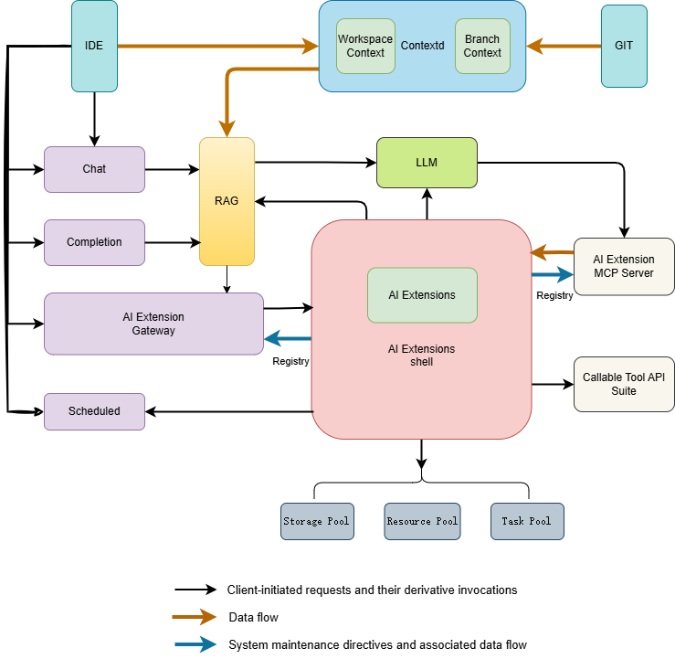

# 诸葛神码 | AI 编程助手

[English](./README.md) | 简体中文

诸葛神码是一款匠心独运的 AI 编程利器，凭借敏锐的代码补全能力与开源生态的无限可能，在 VSCode、JetBrains 等主流开发环境中实现人机无缝协同，以精准的上下文感知与多语言支持，重构开发者的编程范式，让代码创作如行云流水般自然流畅。

## 功能特性
- 代码补全：根据光标的上下文代码，自动生成后续代码，快速秒级出码。

- 智能问答：通过自然语言描述，直接在编程工作区，即可生成代码和技术问答，省心省力

- 快捷菜单：集成最实用功能，一键点击，立码能用（coming soon）

- 智能团：多智能体（Mutil Agent），提供端到端仓库代码生成（coming soon）

- 多语言支持：支持 python、go、java、vue、typescript、javascript、c/c++、shell、lua、php、ruby、SQL等主流语言

- 隐私安全：全栈代码开源，支持服务本地化部署，杜绝敏感信息泄露

## 软件架构
### 整体架构图

### 子模块关系图

## 快速开始
### 部署

请参考 [部署指南](/docs/guide/zh-CN/installation/README.md)

### 构建

请参考 开发文档

## 如何贡献

欢迎贡献代码，贡献流程可以参考 [How To Contribute](docs/devel/zh-CN/how-to-contribute.md)。

## 社区
You are encouraged to communicate most things via [GitHub issues](https://github.com/zgsm-ai/zgsm/issues/new/choose) or pull requests.

## License
IAM is licensed under the MIT. See [LICENSE](LICENSE) for the full license text.
